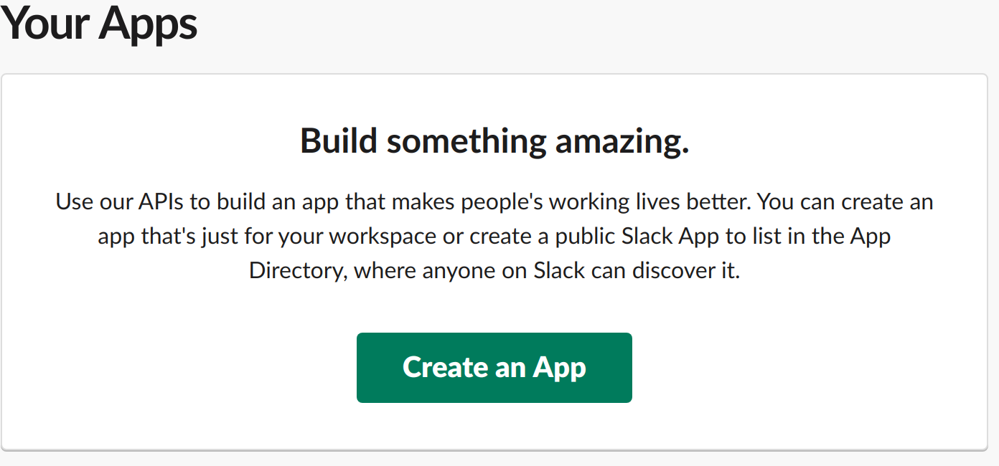
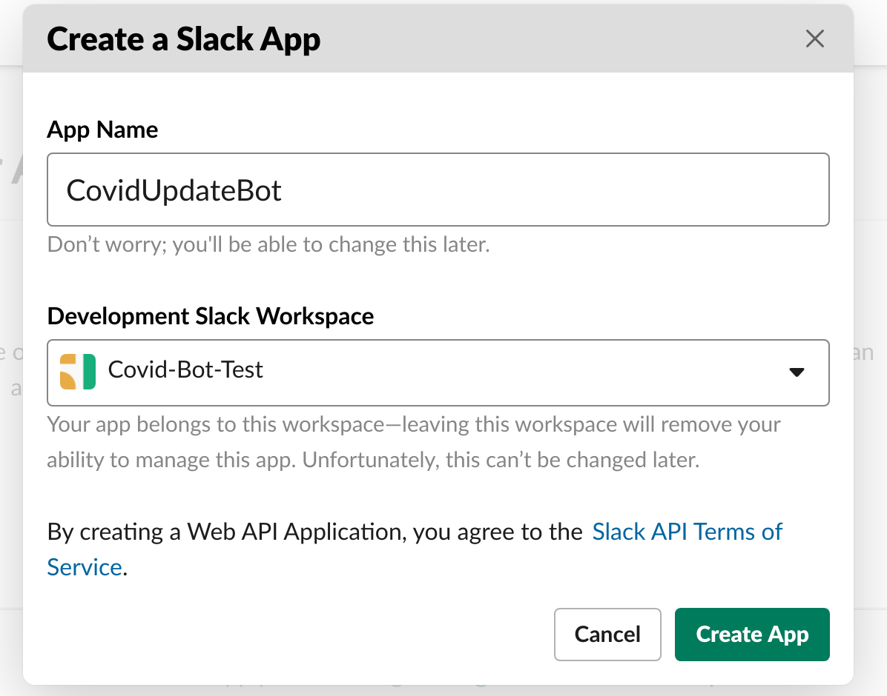
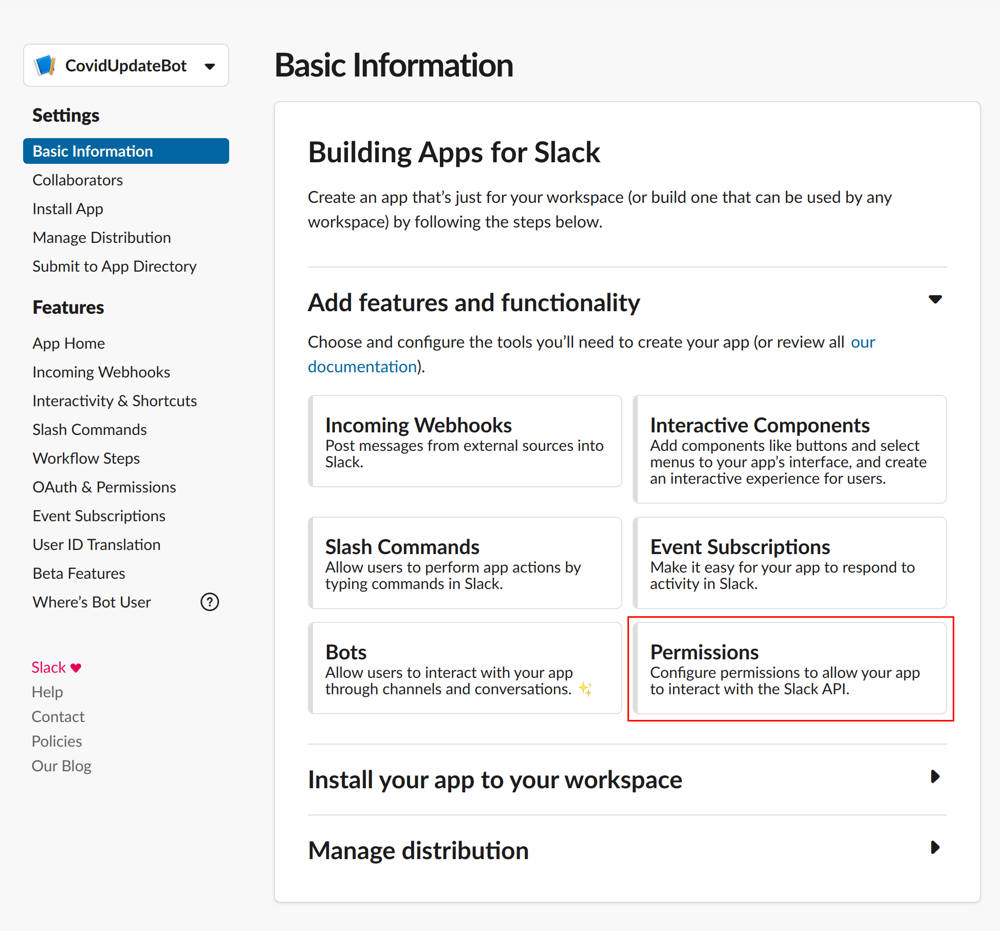
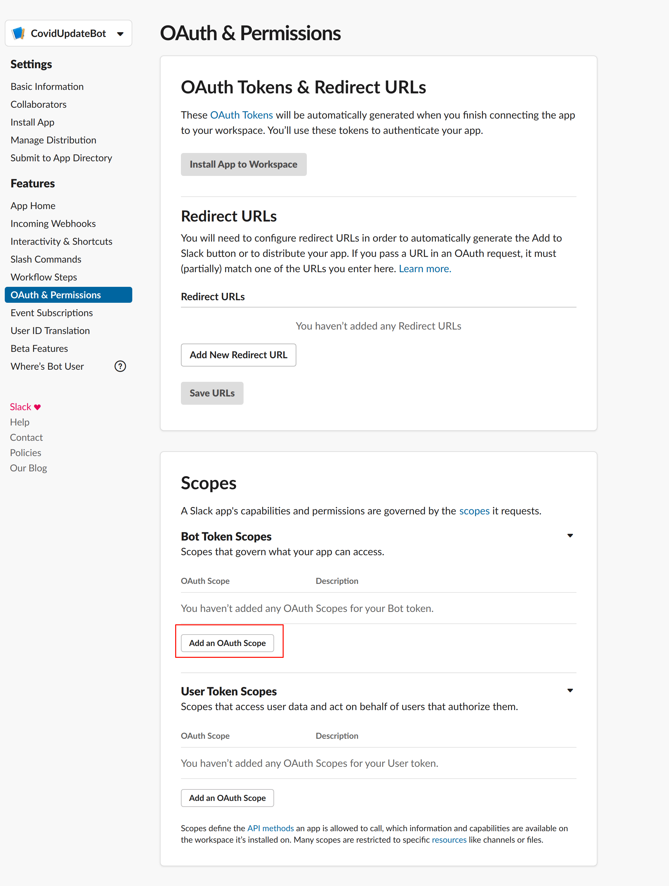
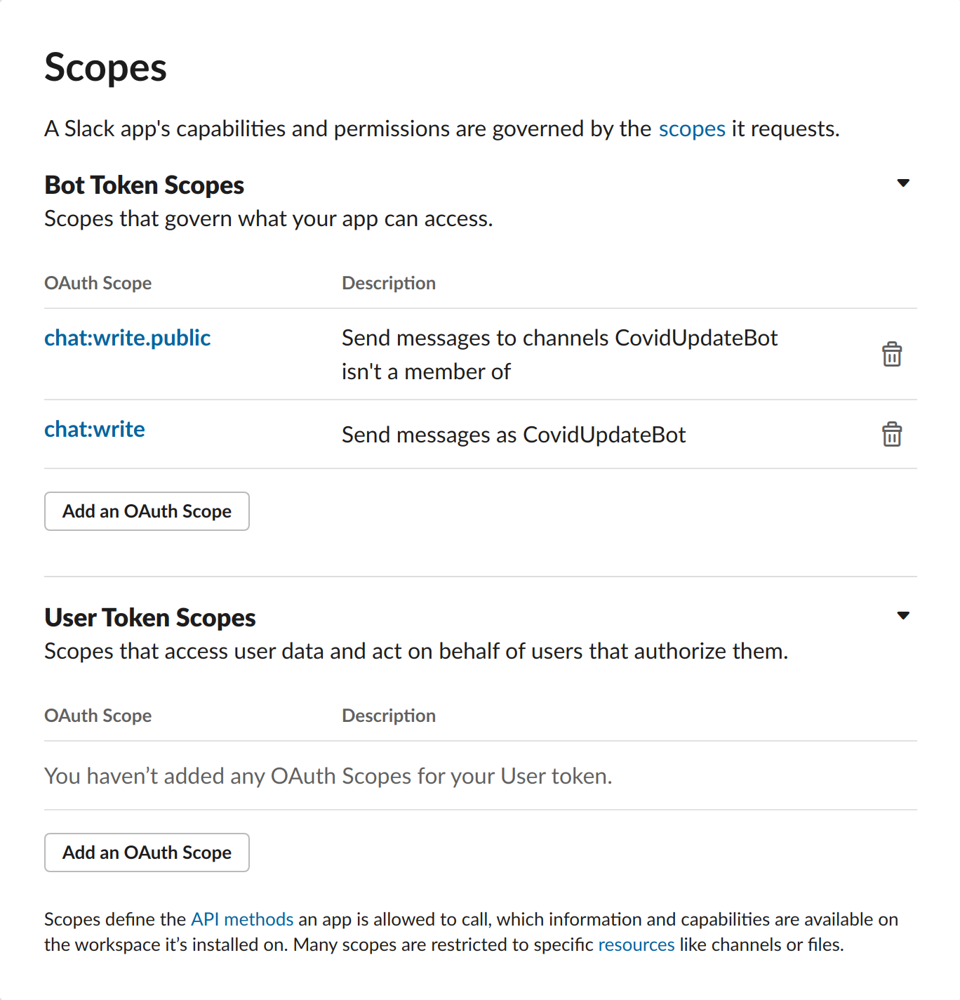
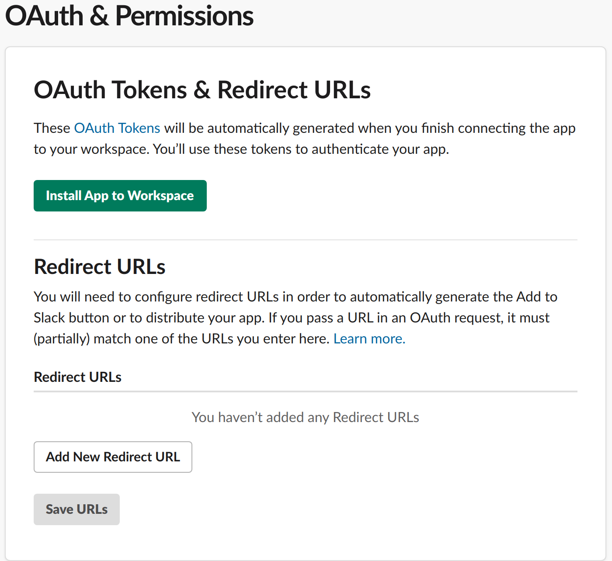
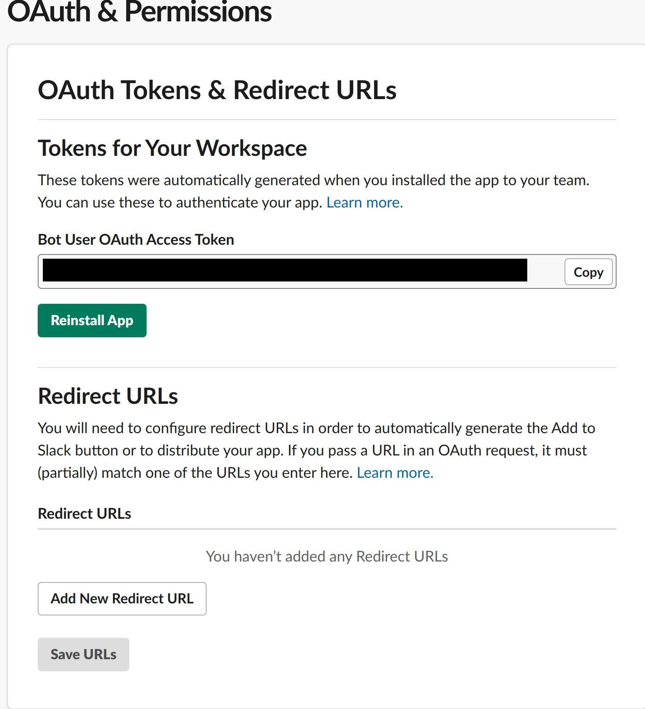

# covid19de_monitor

A simple python script to retrieve COVID19 data from the german RKI (Robert Koch-Institut).

## Motivation

The script collects 7-day-by-100K-people incidents for a pre-defined number of areas.
The data API of the RKI is used:
``https://npgeo-corona-npgeo-de.hub.arcgis.com/datasets/917fc37a709542548cc3be077a786c17_0``

## Usage

### Command Line
Call the script ``COVIDUpdate.py`` with a JSON file in the command line. 
The JSON file defines the areas of interest.  

The example file  ``areas_example.json`` defines the two areas of interest "Würzburg city" and "Würzburg Landkreis":
```
[
    {
        "BEZ": "Kreisfreie Stadt",
        "GEN": "Würzburg"
    },
    {
        "BEZ": "Landkreis",
        "GEN": "Würzburg"
    }
]
```

### API

You may call the script within your own code.
The following snippet retrieves the data for the area of interest "Würzburg city".

```
areas = [{'GEN': 'Würzburg', 'BEZ': 'Kreisfreie Stadt'}]
cu = COVIDUpdate()
result = cu.check(areas)
print(result)
```

See the included Slack-Bot for another example of API use.

## Compatibilty

The script is used with Python 3.8

# Slack-Bot

Let's you directly send the COVID19 data to a slack channel via a custom Slack APP.
Using [slacks python library](https://pypi.org/project/slackclient/).

## Requirements

### slackclient

`pip install slackclient`

### Building your own slack App

1.  Go to your slack workspace and select Manage Apps from Settings & administration

    

2.  Hit Build on the top right

    

3.  Next click on create App

    

4.  Name your App and select your preferred workspace

    

5.  Change the Permissions of your App

    

6.  Add OAuth Scopes to your App

    

7.  Add chat:write and chat:write.public

    

8.  Install the App to your workspace

    

9.  Copy your Bot token and insert it in SlackBot.py

     

10. Finally change the channel in SlackBot.py to your desired channel

